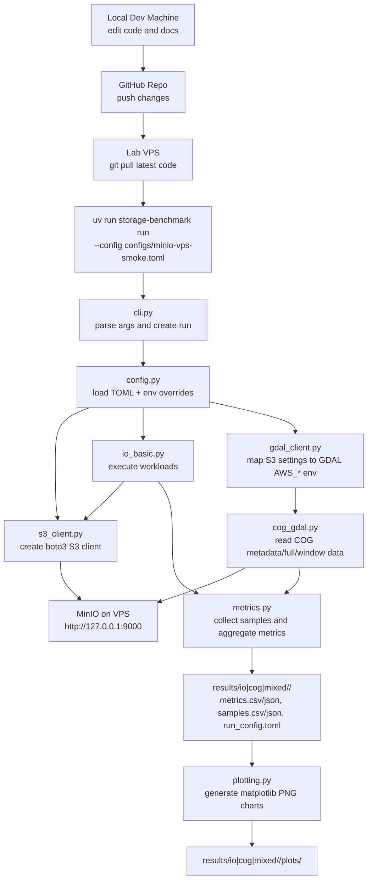
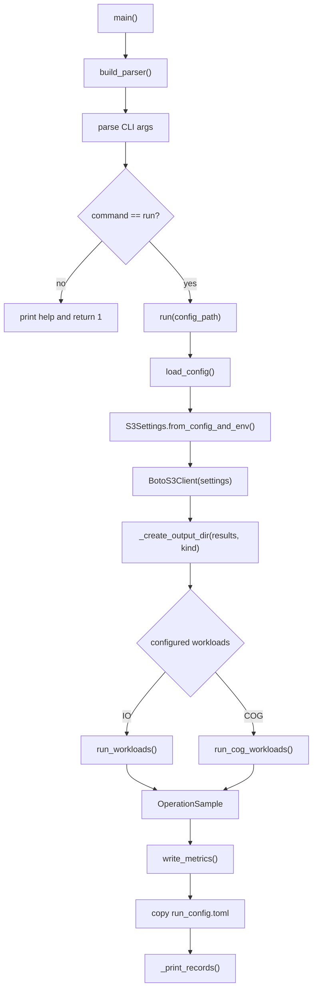
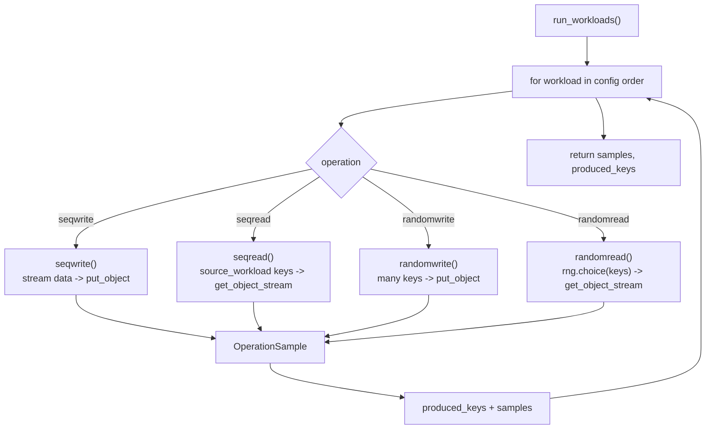
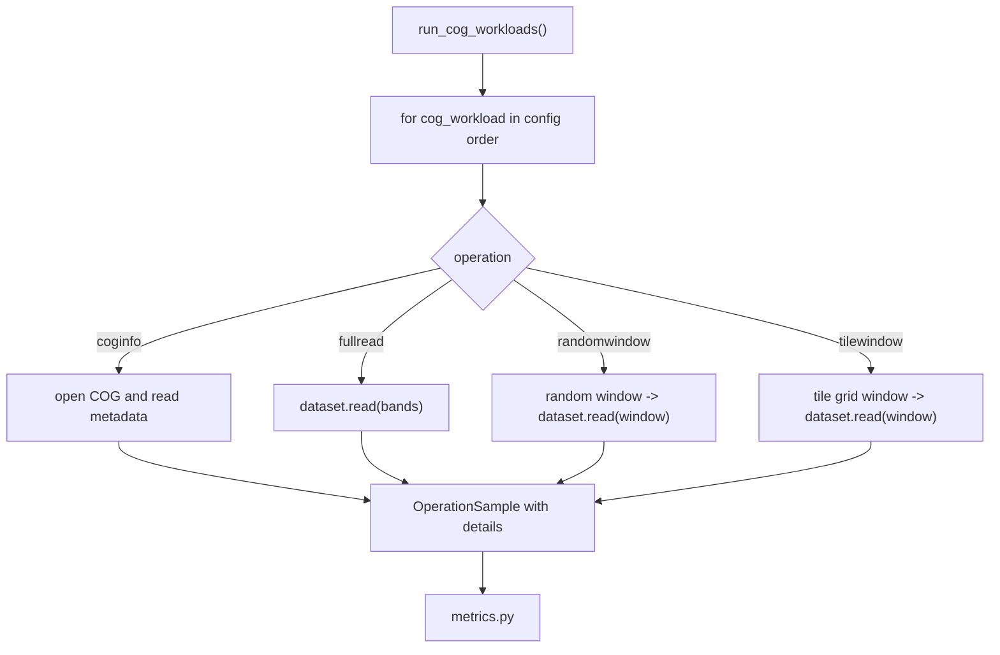

# README Update: VPS MinIO Benchmark Architecture

本文档说明当前版本 benchmark 代码的设计逻辑、文件结构、核心函数、配置含义、运行路径和能力范围。

当前运行背景：

1. 在本地电脑编写和测试代码。
2. 将代码提交并 push 到远程 GitHub 仓库。
3. 实验室 VPS 从远程仓库 `git pull` 最新代码。
4. MinIO 服务运行在 VPS 本机，或通过 VPN/SSH 跳板映射到 VPS 的 `127.0.0.1:9000`。
5. 在 VPS 上运行 benchmark 程序，程序通过 S3 API 访问 MinIO。
6. 测试结果输出到 VPS 当前仓库目录下的 `results/io/<timestamp>/`、`results/cog/<timestamp>/` 或 `results/mixed/<timestamp>/`。

## 1. 整体设计架构

当前代码是轻量化的 Python/uv 项目，已覆盖报告阶段 1 的基础 IO 性能测试，并新增 COG/GDAL 读取 benchmark 设计。整体逻辑是：

```text
配置文件 + 环境变量
        |
        v
CLI 入口解析运行参数
        |
        v
加载 benchmark 配置
        |
        v
创建 S3/MinIO 或 GDAL/rasterio 访问上下文
        |
        v
按顺序执行 IO workload 或 COG workload
        |
        v
采集每次读写操作样本
        |
        v
汇总吞吐、延迟、IOPS
        |
        v
输出 CSV/JSON 结果
```

### 1.1 运行链路流程图



## 2. 文件夹与文件职责

当前仓库结构如下：

```text
.
├── configs/
├── src/storage_benchmark/
├── tests/
├── README.md
├── README-UPDATE.md
├── main.py
├── pyproject.toml
└── uv.lock
```

### 2.1 `configs/`

这里存放 benchmark 的运行配置。程序运行时通过 `--config` 指定其中一个 TOML 文件。

运行示例：

```bash
uv run storage-benchmark run --config configs/minio-vps-smoke.toml
```

配置文件中的逻辑：

- `[s3]`：对象存储连接配置。
- `[run]`：本次运行的通用配置。
- `[[workloads]]`：一个或多个测试任务，程序会按文件中的顺序执行。
- `[[cog_workloads]]`：一个或多个 COG/GDAL 读取测试任务，读取 MinIO 中已有 COG 对象。

文件说明：

`configs/minio-vps-smoke.toml`

- 面向实验室 VPS 的默认 smoke 配置。
- 默认 endpoint 是 `http://127.0.0.1:9000`。
- 默认 bucket 是 `benchmark`。
- 包含 16KiB 小对象随机读写和 10MiB 中等对象顺序读写。
- 推荐作为 VPS 首次连通性验证配置。

`configs/minio-smoke.toml`

- 通用 smoke 配置。
- 内容与 VPS smoke 接近，key prefix 使用 `benchmark/smoke/...`。
- 用于快速验证 MinIO 是否可访问、读写链路是否正常。

`configs/minio-full.toml`

- 完整规模测试配置。
- 包含 16KiB、10MiB、4GiB、10GiB。
- 会产生大对象和较长运行时间，只应在确认 VPS、MinIO bucket 容量和网络稳定后运行。

`configs/minio-matrix.toml`

- 完整矩阵测试配置。
- 对 16KiB、10MiB、4GiB 分别运行 `seqwrite`、`seqread`、`randomwrite`、`randomread`。
- 用于需要完整横向对比时显式运行；10GiB 大对象仍只放在 full 配置中，避免矩阵测试流量过大。

`configs/minio-cog-smoke.toml`

- COG/GDAL smoke 配置。
- 默认读取 `s3://benchmark/cog/sample.tif`，该 COG 需要提前上传到 MinIO。
- 覆盖 `coginfo`、`fullread`、`randomwindow`、`tilewindow` 四类读取场景。
- 结果输出到 `results/cog/<timestamp>/`。

### 2.2 `src/storage_benchmark/`

这里是 benchmark 程序的核心代码。`pyproject.toml` 中将该目录声明为 Python package。

`src/storage_benchmark/cli.py`

- 命令行入口。
- 由 `storage-benchmark` 命令调用。
- 负责串联完整运行流程：解析参数、加载配置、创建客户端、执行 workload、输出结果。
- 结果输出在配置文件 `[run].output_dir` 指定目录下，并按 benchmark 类型区分为 `io`、`cog`、`mixed` 子目录。

`src/storage_benchmark/config.py`

- 配置解析和校验模块。
- 使用标准库 `dataclasses` 和 `tomllib`，避免额外配置框架依赖。
- 将 TOML 内容转换为程序内部对象：
  - `S3Config`
  - `RunConfig`
  - `WorkloadConfig`
  - `CogWorkloadConfig`
  - `BenchmarkConfig`
  - `S3Settings`
- 支持环境变量覆盖部分配置。

`src/storage_benchmark/s3_client.py`

- S3/MinIO 访问层。
- 使用 `boto3` 创建 S3-compatible client。
- 当前连接 MinIO，后续也可连接 Ceph RGW。
- 对上层 workload 暴露简单接口：上传对象、读取对象流、删除对象、按 prefix 列出对象。

`src/storage_benchmark/io_basic.py`

- 基础 IO workload 实现。
- 包含四类操作：
  - `seqwrite`
  - `seqread`
  - `randomwrite`
  - `randomread`
- 这里是真正执行 MinIO 读写的核心模块。

`src/storage_benchmark/gdal_client.py`

- GDAL/rasterio 访问层。
- 将当前 `S3Settings` 映射为 GDAL 识别的 `AWS_*` 配置。
- 构造 `/vsis3/<bucket>/<object_key>` 路径，供 rasterio 读取 MinIO 中的 COG。

`src/storage_benchmark/cog_gdal.py`

- COG/GDAL workload 实现。
- 包含四类操作：
  - `coginfo`
  - `fullread`
  - `randomwindow`
  - `tilewindow`
- 每次读取都会生成 `OperationSample`，并在 `details` 字段记录影像尺寸、block shape、band、窗口坐标等信息。

`src/storage_benchmark/metrics.py`

- 指标采集和汇总模块。
- 将每次对象读写记录为 `OperationSample`。
- 将样本聚合为 `MetricRecord`。
- 写出 `metrics.csv`、`metrics.json`、`samples.csv` 和 `samples.json`。

`src/storage_benchmark/plotting.py`

- 结果可视化模块。
- 从 `results/io|cog|mixed/<timestamp>/metrics.csv` 和 `samples.csv` 读取数据。
- 使用 matplotlib 生成吞吐、IOPS、延迟摘要和延迟分布图。

`src/storage_benchmark/__init__.py`

- Python package 标识文件。
- 当前只保存版本号。

### 2.3 `tests/`

这里是本地单元测试。测试不连接真实 MinIO，而是使用 `FakeS3Client` 模拟 S3 行为。

`tests/conftest.py`

- 定义 `FakeS3Client`。
- 用内存字典模拟对象存储。
- 记录 put/get/delete 调用，便于断言 workload 是否按预期访问 S3。

`tests/test_config.py`

- 测试配置加载、容量字符串解析、VPS 默认 endpoint、环境变量覆盖和缺失密钥报错。

`tests/test_io_basic.py`

- 测试四类 IO workload 会正确调用 S3 client。
- 不依赖真实网络或 MinIO。

`tests/test_metrics.py`

- 测试吞吐、平均延迟、P95/P99、IOPS 的计算逻辑。

### 2.4 根目录文件

`pyproject.toml`

- uv/Python 项目配置。
- 定义项目依赖：当前运行依赖包括 `boto3`、`matplotlib`、`rasterio`。
- 定义开发依赖：`pytest`。
- 定义命令行入口：

```toml
[project.scripts]
storage-benchmark = "storage_benchmark.cli:main"
```

`uv.lock`

- uv 锁文件。
- 保证 VPS 上安装到一致的依赖版本。

`main.py`

- 兼容入口。
- 直接调用 `storage_benchmark.cli.main()`。
- 推荐实际运行时使用 `uv run storage-benchmark ...`。

`README.md`

- 简明使用说明。

`README-UPDATE.md`

- 当前文档，解释架构和代码逻辑。

## 3. 配置、变量和核心函数逻辑

### 3.1 配置文件核心字段

以 `configs/minio-vps-smoke.toml` 为例：

```toml
[s3]
endpoint_url = "http://127.0.0.1:9000"
bucket = "benchmark"
region = "us-east-1"
use_ssl = false
```

字段含义：

- `endpoint_url`：MinIO S3 API 地址。VPS 本机 MinIO 或隧道映射时使用 `http://127.0.0.1:9000`。
- `bucket`：测试对象写入的 bucket。运行前需要确认 bucket 存在。
- `region`：S3 region。MinIO 通常可使用 `us-east-1`。
- `use_ssl`：是否启用 HTTPS。当前 VPS 本地测试默认 `false`。

```toml
[run]
name = "minio-vps-smoke"
output_dir = "results"
seed = 42
repeats = 3
cleanup = false
```

字段含义：

- `name`：本次配置名称，仅用于识别。
- `output_dir`：结果输出根目录。基础 IO 输出到 `results/io/<timestamp>/`，COG/GDAL 输出到 `results/cog/<timestamp>/`，混合配置输出到 `results/mixed/<timestamp>/`。
- `seed`：随机读选择 key 时使用的随机种子，保证结果可复现。
- `repeats`：整组 workload 的重复执行次数。smoke/VPS smoke 默认 3 次，full 默认 1 次，避免大对象流量被意外放大。
- `cleanup`：是否在测试后删除本次产生的对象。当前默认 `false`，便于复查 MinIO 中的对象。

```toml
[[workloads]]
name = "small-random-write"
operation = "randomwrite"
object_size = "16KiB"
iterations = 20
chunk_size = "16KiB"
key_prefix = "benchmark/vps/small"
```

字段含义：

- `name`：workload 名称，必须唯一。
- `operation`：操作类型，支持 `seqwrite`、`seqread`、`randomwrite`、`randomread`。
- `object_size`：单个对象大小，支持 `B`、`KiB`、`MiB`、`GiB` 等写法。
- `iterations`：执行次数。
- `chunk_size`：生成或读取数据时的分块大小。
- `key_prefix`：写入 MinIO 时对象 key 的前缀。
- `source_workload`：读操作的数据来源，必须指向前面某个写 workload。

COG/GDAL workload 示例：

```toml
[[cog_workloads]]
name = "cog-random-window"
operation = "randomwindow"
object_key = "cog/sample.tif"
iterations = 50
window_width = 512
window_height = 512
band_indexes = [1]
```

字段含义：

- `operation`：支持 `coginfo`、`fullread`、`randomwindow`、`tilewindow`。
- `object_key`：MinIO bucket 中已有 COG 的 key，例如 `cog/sample.tif`。
- `bucket`：可选；不填时使用 `[s3].bucket`。
- `window_width` / `window_height`：窗口读取尺寸，`randomwindow` 和 `tilewindow` 必填。
- `band_indexes`：读取的波段列表，默认 `[1]`。

### 3.2 环境变量

敏感信息不写入配置文件，通过环境变量提供：

```bash
export S3_ACCESS_KEY_ID="minioadmin"
export S3_SECRET_ACCESS_KEY="minioadmin"
```

必填：

- `S3_ACCESS_KEY_ID`
- `S3_SECRET_ACCESS_KEY`

可选覆盖：

- `S3_ENDPOINT_URL`：覆盖 TOML 中的 `[s3].endpoint_url`。
- `S3_BUCKET`：覆盖 TOML 中的 `[s3].bucket`。
- `S3_REGION`：覆盖 TOML 中的 `[s3].region`。
- `S3_USE_SSL`：覆盖 TOML 中的 `[s3].use_ssl`。

配置优先级：

```text
环境变量 > TOML 配置文件 > 代码默认值
```

### 3.3 `cli.py` 核心逻辑

核心函数：

`main(argv=None)`

- 构建命令行解析器。
- 解析 `storage-benchmark run --config ...`。
- 分发到 `run(config_path)`。

`build_parser()`

- 使用 `argparse` 定义 CLI。
- 当前包含两个子命令：`run` 和 `plot`。
- `--config/-c` 默认值是 `configs/minio-smoke.toml`。

`run(config_path)`

- 加载 TOML 配置。
- 合并配置文件和环境变量，生成 `S3Settings`。
- 创建 `BotoS3Client`。
- 使用配置中的 `seed` 创建随机数生成器。
- 根据配置内容创建输出目录：`results/io|cog|mixed/<timestamp>/`。
- 调用 `run_workloads(...)` 执行基础 IO 测试任务。
- 调用 `run_cog_workloads(...)` 执行 COG/GDAL 测试任务。
- 调用 `write_metrics(...)` 写出结果。
- 复制本次配置文件到结果目录中的 `run_config.toml`。

`_benchmark_kind(config)`

- 如果只有 `[[workloads]]`，返回 `io`。
- 如果只有 `[[cog_workloads]]`，返回 `cog`。
- 如果两者都有，返回 `mixed`。

`_create_output_dir(root, benchmark_kind)`

- 用 UTC 时间生成唯一结果目录。
- 示例：`results/cog/20260518T162700Z/`。

`_print_records(records)`

- 将汇总指标打印到终端。

#### CLI 函数流程图



### 3.4 `config.py` 核心逻辑

核心数据结构：

- `Operation`：操作类型枚举。
- `CogOperation`：COG/GDAL 操作类型枚举。
- `S3Config`：TOML 中 `[s3]` 的配置。
- `RunConfig`：TOML 中 `[run]` 的配置。
- `WorkloadConfig`：每个 `[[workloads]]` 的配置。
- `CogWorkloadConfig`：每个 `[[cog_workloads]]` 的配置。
- `BenchmarkConfig`：完整配置对象。
- `S3Settings`：最终用于创建 S3 client 的配置，包含密钥。

核心函数：

`load_config(path)`

- 读取 TOML 文件。
- 分别解析 `[s3]`、`[run]`、`[[workloads]]`、`[[cog_workloads]]`。
- 调用 `_validate_config(...)` 做基础校验。

`S3Settings.from_config_and_env(config)`

- 从 TOML 的 `S3Config` 读取默认 endpoint、bucket、region、use_ssl。
- 从环境变量读取敏感信息。
- 允许环境变量覆盖 endpoint、bucket、region、use_ssl。
- 缺少 `S3_ACCESS_KEY_ID` 或 `S3_SECRET_ACCESS_KEY` 时直接报错。

`parse_size(value)`

- 将 `"16KiB"`、`"10MiB"`、`"4GiB"` 等字符串转换成字节数。

`parse_bool(value)`

- 将 `true/false`、`yes/no`、`1/0` 等转换成布尔值。

`_validate_config(config)`

- 确认至少有一个基础 IO workload 或 COG workload。
- 确认 workload 名称唯一。
- 确认对象大小、执行次数、chunk size 都大于 0。
- 确认 `seqread` 和 `randomread` 必须配置 `source_workload`。
- 确认 `source_workload` 指向已存在的 workload。
- 确认 COG workload 有 `object_key`、正数 iterations、正数 band indexes。
- 确认窗口读取类 COG workload 配置了正数 `window_width` 和 `window_height`。

### 3.5 `s3_client.py` 核心逻辑

核心结构：

`S3Client`

- Python `Protocol`，定义 workload 需要的最小对象存储接口。
- 这样测试中可以用 `FakeS3Client` 替代真实 MinIO。

`BotoS3Client`

- 使用 `boto3.client("s3", ...)` 创建真实 S3-compatible client。
- 当前用于访问 MinIO。

核心方法：

- `put_object(key, body, content_length)`：上传对象。
- `get_object_stream(key)`：获取对象读取流。
- `delete_object(key)`：删除对象。
- `list_keys(prefix)`：列出指定 prefix 下的对象 key。

### 3.6 `io_basic.py` 核心逻辑

核心类：

`DeterministicBytesStream`

- 按需生成确定性字节流。
- 不会一次性把 4GiB/10GiB 对象放进内存。
- 基于 `seed + block_index` 生成 SHA-256 数据块。
- 支持 `read()`、`seek()`、`tell()` 和 `seekable()`，适配 boto3 上传时可能发生的回退重读，避免 `Error: seek`。

核心函数：

`run_workloads(workloads, client, rng)`

- 按配置顺序执行所有 workload。
- 维护 `produced_keys`，记录每个写 workload 产生的对象 key。
- 读 workload 根据 `source_workload` 找到前置写 workload 的对象。

`seqwrite(workload, client, samples)`

- 顺序生成对象 key。
- 使用 `DeterministicBytesStream` 生成对象内容。
- 上传到 MinIO。
- 记录一次 `OperationSample`。

`seqread(workload, client, produced_keys, samples)`

- 读取 `source_workload` 产生的对象。
- 按 `chunk_size` 分块读取对象内容。
- 记录读取耗时和字节数。

`randomwrite(workload, client, samples)`

- 写入多个对象。
- key 格式是 `key_prefix/name/object-000000.bin`。
- 用于小对象/中对象 IOPS 测试。

`randomread(workload, client, produced_keys, samples, rng)`

- 从 `source_workload` 的对象集合中随机选择 key。
- 执行多次读取。
- 用于随机读延迟和 IOPS 测试。

`cleanup_keys(client, keys_by_workload)`

- 当 `[run].cleanup = true` 时删除本次产生的对象。
- 当前配置默认不清理。

`_measure_upload(...)`

- 记录上传开始时间。
- 调用 `client.put_object(...)`。
- 计算耗时。
- 生成 `OperationSample`。

`_measure_download(...)`

- 调用 `client.get_object_stream(...)`。
- 按 chunk 读取直到 EOF。
- 统计读取总字节数和耗时。
- 生成 `OperationSample`。

#### Workload 执行流程图



### 3.7 `gdal_client.py` 与 `cog_gdal.py` 核心逻辑

`gdal_client.py`

- `rasterio_env_kwargs(settings)`：把项目内部的 `S3Settings` 转换成 GDAL/rasterio 识别的 `AWS_*` 参数。
- `vsi_s3_path(bucket, object_key)`：生成 `/vsis3/<bucket>/<object_key>` 路径。
- `open_raster(settings, bucket, object_key)`：在 `rasterio.Env(...)` 上下文内打开远程 COG。

这些 `AWS_*` 参数是 GDAL S3 驱动的通用命名，不代表只能连接 AWS；MinIO 和 Ceph RGW 也复用同一套 S3 兼容参数。

`cog_gdal.py`

- `run_cog_workloads(...)`：按配置顺序执行所有 COG workload。
- `coginfo(...)`：打开 COG 并读取元数据，统计打开和元数据读取耗时。
- `fullread(...)`：读取指定波段的全图数据，统计读取耗时和数组字节数。
- `randomwindow(...)`：按随机窗口读取 COG，用于观察远程 COG 分块读取延迟。
- `tilewindow(...)`：按固定网格窗口读取 COG，用于模拟瓦片式访问。

COG/GDAL 执行流程：



### 3.8 `metrics.py` 核心逻辑

核心数据结构：

`OperationSample`

- 表示单次对象操作。
- 字段包括 workload、operation、object_key、bytes_count、duration_seconds、started_at、repeat_index、details。
- 基础 IO 样本的 `details` 通常为空；COG/GDAL 样本会记录影像元数据和窗口坐标。

`MetricRecord`

- 表示聚合后的指标。
- 字段包括 operations、bytes_total、duration_seconds、throughput_mb_s、avg_latency_ms、p95_latency_ms、p99_latency_ms、iops。

核心函数：

`summarize_samples(samples)`

- 按 `(workload, operation)` 分组。
- 对每组样本计算总字节数、总耗时、吞吐量、平均延迟、P95/P99、IOPS。

`percentile(values, percentile_value)`

- 对延迟列表做线性插值百分位计算。

`write_metrics(output_dir, samples)`

- 创建结果目录。
- 写出 `metrics.json`。
- 写出 `metrics.csv`。
- 写出 `samples.json`。
- 写出 `samples.csv`。
- 返回聚合后的 `MetricRecord` 列表。

`generate_plots(result_dir, output_dir)`

- 读取 `result_dir/metrics.csv` 和 `result_dir/samples.csv`。
- 默认输出到 `result_dir/plots/`。
- 生成 `throughput_mb_s.png`、`iops.png`、`latency_summary_ms.png`、`latency_distribution_ms.png`。
- 如果样本中包含 COG/GDAL 操作，还会额外生成：
  - `cog_latency_by_operation_ms.png`
  - `cog_read_size_mb.png`
  - `cog_latency_over_time_ms.png`
  - `cog_window_latency_scatter_ms.png`

指标计算公式：

```text
throughput_mb_s = bytes_total / 1024 / 1024 / duration_seconds
avg_latency_ms = duration_seconds / operations * 1000
iops = operations / duration_seconds
```

## 4. 运行方式与输出路径

### 4.1 VPS 上首次准备

```bash
git pull
uv sync --dev
```

设置 MinIO 密钥：

```bash
export S3_ACCESS_KEY_ID="minioadmin"
export S3_SECRET_ACCESS_KEY="minioadmin"
```

如果 MinIO 不在 VPS 本机或本地端口不是 `9000`，覆盖 endpoint：

```bash
export S3_ENDPOINT_URL="http://<minio-host>:9000"
```

### 4.2 推荐 smoke 测试

```bash
uv run storage-benchmark run --config configs/minio-vps-smoke.toml
```

代码运行位置：

```text
<repo-root>/src/storage_benchmark/
```

配置读取位置：

```text
<repo-root>/configs/minio-vps-smoke.toml
```

结果输出位置：

```text
<repo-root>/results/io/<timestamp>/
```

输出文件：

```text
metrics.csv
metrics.json
samples.csv
samples.json
run_config.toml
```

生成图表：

```bash
uv run storage-benchmark plot --result-dir results/io/<timestamp>
```

输出位置：

```text
<repo-root>/results/io/<timestamp>/plots/
```

### 4.3 完整测试

```bash
uv run storage-benchmark run --config configs/minio-full.toml
```

注意：完整测试会写入 4GiB 和 10GiB 对象，运行前需要确认 VPS 网络、MinIO bucket、磁盘容量和运行时间窗口。

### 4.4 完整矩阵测试

```bash
uv run storage-benchmark run --config configs/minio-matrix.toml
```

注意：matrix 配置会让 small、medium、large 都覆盖随机读写和顺序读写，适合做完整横向对比，不建议作为日常快速验证。

### 4.5 本地单元测试

### 4.5 COG/GDAL 测试

先确认 MinIO 中已有 COG 对象。默认配置读取：

```text
s3://benchmark/cog/sample.tif
```

运行：

```bash
uv run storage-benchmark run --config configs/minio-cog-smoke.toml
```

结果输出位置：

```text
<repo-root>/results/cog/<timestamp>/
```

如果一个配置文件同时包含 `[[workloads]]` 和 `[[cog_workloads]]`，结果会输出到：

```text
<repo-root>/results/mixed/<timestamp>/
```

### 4.6 本地单元测试

```bash
uv run pytest
```

单元测试不会访问真实 MinIO，只验证代码逻辑。

## 5. 当前版本能力范围

当前版本已经支持：

- 在 VPS 上通过 S3 API 访问 MinIO。
- 使用 `127.0.0.1:9000` 作为默认 VPS MinIO endpoint。
- 通过环境变量保护 MinIO access key 和 secret key。
- 用 TOML 文件定义 benchmark 测试任务。
- 执行 4 类基础 IO：
  - 顺序写
  - 顺序读
  - 随机写
  - 随机读
- 流式生成测试对象，避免大对象一次性占用内存。
- 分块读取对象，支持大对象读取测试。
- 输出 CSV/JSON 指标结果。
- 计算吞吐量、平均延迟、P95/P99 延迟、IOPS。
- 使用 mock S3 client 做单元测试，不依赖真实 MinIO。
- 后续通过替换 endpoint 连接 Ceph RGW。
- 使用 rasterio/GDAL 读取 MinIO 中已有 COG 对象。
- 执行 COG 元数据读取、全图读取、随机窗口读取和固定瓦片窗口读取。
- 用 `details` 字段记录 COG 影像元数据和窗口坐标，便于后续分析。

当前版本暂不支持：

- 并发 worker 压测。
- 自动创建 bucket。
- 自动部署 MinIO。
- 自动生成、上传或转换 COG。
- 跨多台 VPS 的分布式压测。
- MinIO/Ceph 自动对比报告。

## 6. 后续建议

下一阶段建议按以下顺序扩展：

1. 增加 `--dry-run`，运行前打印将执行的 workload 和 S3 endpoint，避免误跑 full 配置。
2. 增加 bucket 连通性检查，例如启动时执行一次 `list_objects_v2` 或 head bucket。
3. 增加并发参数，例如 `workers = 4`，测试并发读写性能。
4. 增加 COG 样本准备脚本，例如校验 COG 是否存在、是否可被 GDAL 远程打开。
5. 增加并发 COG window read，测试多 worker 下的远程 COG 读取能力。
